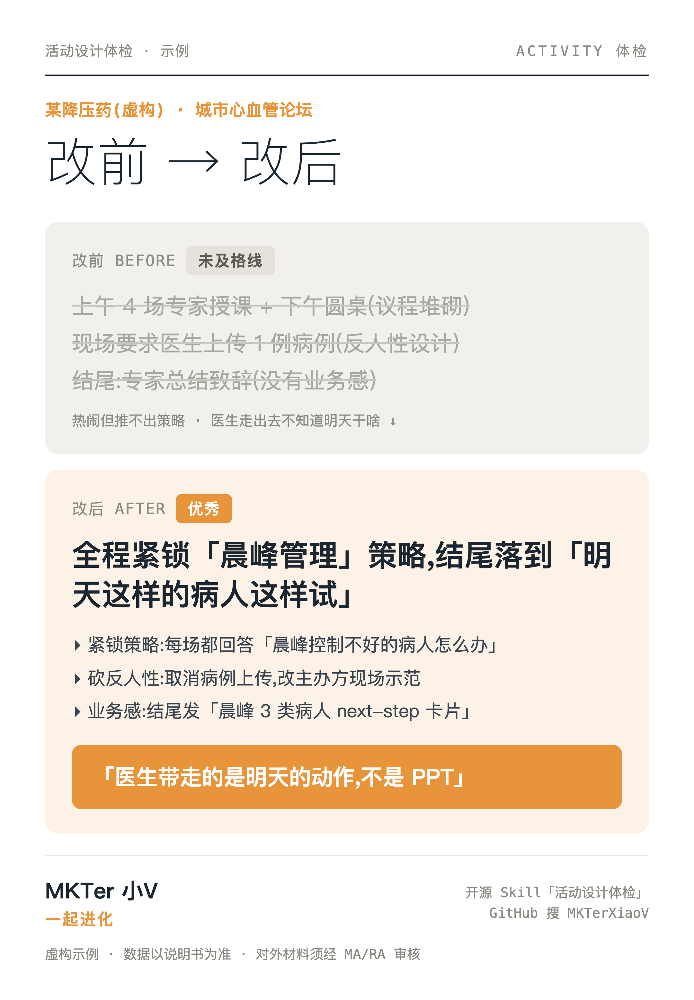

# MKTer 小V · 活动设计体检 Skill

> 医药市场 **活动/会议方案体检 + 判断校准** 引擎(体检系列 ②)。
> 别人帮你办活动,它帮你**审**——挑出"热闹但推不出策略""医生走出去不知道干什么"的虚症,算清客户体验这道加减法,把"领导致辞合影散会"改成有业务感的收尾。
>
> *A pharma-marketing **activity-design review & judgment-calibration** engine for AI agents. It doesn't design events — it audits them: catches strategy-disconnected agendas, anti-human-nature tasks, and endings with no business takeaway.*

> ⭐ **装上觉得有用?顺手点个 Star** —— 让更多医药市场部同行刷到它,也让我知道这条路走得通。



> 上图为 skill 生成的"改前 vs 改后"对比卡(示例为**虚构降压药城市论坛**)。

---

## 这是什么

一个给 AI(Claude Code / 任意对话式 AI)用的**医药活动方案审视引擎**。喂给它一份学术活动/会议/论坛/科室会方案,它会:

1. **体检评级** —— 及格 / 良好 / 优秀,一句话总诊断(低于及格线 = 建议返工)。
2. **逐条挑刺** —— 必引方案原句:紧锁策略没、有没有反人性设计、有没有峰终体验、结尾有没有业务感。
3. **改写建议** —— 把虚症环节改成有策略、有业务感的样子("医生明天这样的病人这样试")。
4. **深档** —— 模拟老板/评审会顶的 3 个问题 + 可选生成"改前 vs 改后"对比卡图片。
5. **🆕 评审团(增强档,点名才启动)** —— 说"上评审团":7 位各守一个透镜的评委**盲审** → 每条挑刺过 4 位反驳者**对抗验证**(≥2 票推翻即毙) → 主笔合成。实测同一份方案:单次体检挑出 4 条,评审团挑出 16 条(多出合规、资产沉淀两条线)。需多智能体环境,单对话自动降级"多轮自审";消耗约标准档 30–50 倍,只建议用于正式过评审的方案。协议见 `references/评审团协议.md`,真实全程样张见 `examples/评审团-样张.md`。

**它只体检,不替你设计活动、不写日程。**

## 为什么做它

> 市场部最常见的病不是"不会办活动",是**办得热闹但反推不出策略**。

议程堆砌、要医生上传病例录视频、结尾领导致辞草草合影——每一条都在悄悄给客户体验扣分,而且没人帮你"审"。这个引擎补的就是**判断 + 体验账 + 业务感**这一层:客户体验 = ∑正体验 − ∑负体验,五大虚症逐条比对。

## 怎么用

**作为 Claude Code skill**:把本仓库放进 `~/.claude/skills/activity-design-review/`,然后对 AI 说"用活动设计体检帮我看看这份方案"。

**作为通用提示词**:把 `SKILL.md` 的内容粘进任意对话式 AI(豆包 / ChatGPT / Claude 网页),它会自动降级成"编号提问"模式,照样能跑。

**三档深度**(按你给的输入自动调,也可指定):

| 你给的 | 走哪档 | 得到什么 |
|---|---|---|
| 一句活动想法 / 一个主题 | **速检** | 挑最大 1–2 个虚症 |
| 一份方案 / 日程 / 一页 slide | **标准** | 五大虚症全过 + 改写建议 |
| 完整方案 + 要应对评审/老板 | **深档** | + 模拟提问 + 对比卡 |

### 生成"改前 vs 改后"对比卡

```bash
# 依赖:Node 18+ 与 playwright(或本机 Google Chrome,脚本会自动回退)
npm i -D playwright && npx playwright install chromium

node scripts/render-card.mjs examples/活动方案-card.json out.png
```

文字类对比卡用 **HTML 渲染**(文字像素级精确),不用文生图。数据 schema 见 `scripts/render-card.mjs` 头注释或 `examples/活动方案-card.json`。仓库内若存在 `assets/avatar.png` 会内嵌为署名头像,没有则自动省略。

### 自定义你自己的偏好

复制 `EXTEND.example.md` 为 `EXTEND.md`,填入你的真实受众、活动类型、主菜配菜偏好与禁用词。`EXTEND.md` 已被 `.gitignore` 忽略——你的真实数据只留在本地,不会进仓库。

## 目录

| 文件 | 作用 |
|---|---|
| `SKILL.md` | 入口:首次引导 + 双透镜 + 体检流程 + 三档 + 评级 + references 索引 |
| `references/` | 方法内核:体验公式与三技巧 / 五大虚症 / 体检清单 / 主菜配菜与参与度 / 评分卡 / 合规红线 |
| `scripts/render-card.mjs` | 把对比卡渲染成 PNG(自包含) |
| `EXTEND.example.md` | 用户偏好/禁用词模板 |
| `examples/` | 全脱敏样张(虚构产品) |
| `能力圈.md` | 做什么 / 不做什么 + 不可协商红线 |

## ⚠️ 免责声明(含脱敏说明)

- 本工具做的是**活动方案质量审视 + 改写建议 + 常见合规风险初筛**,**不替代**任何公司的医学与法规审核(MA/RA)。
- **不提供医疗或法律建议**;所有疗效/安全数据须以产品说明书为准,工具不会、也不应杜撰数据。
- 仓库内所有示例(降压药城市论坛等)**纯属虚构**,仅作演示;请在脱敏后再把方案发给 AI(别带真实产品名/内部数据/未公开材料)。
- 使用者对其最终产出的合规性负责。

## License

[MIT](LICENSE) © 2026 MKTer 小V

---

*Made by **MKTer 小V** · 一起进化 —— 一线医药市场人 × AI 的内容工作方式。*
