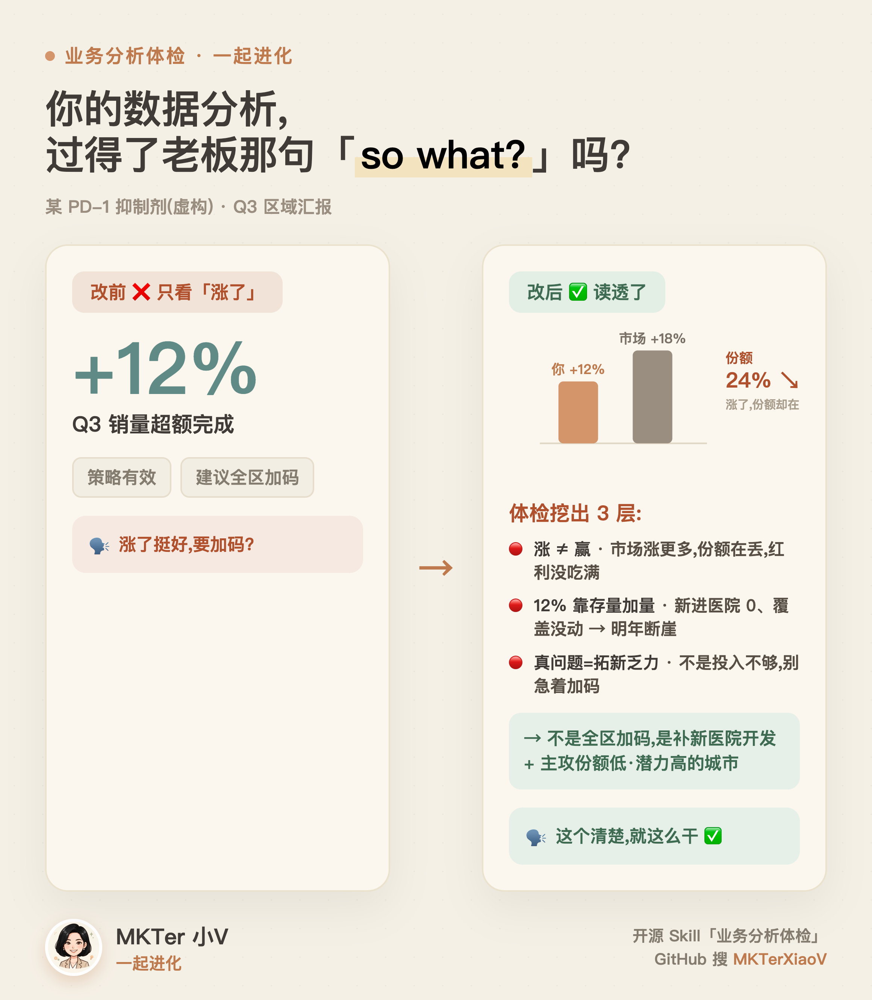

# MKTer 小V · 业务分析体检 Skill

> **你的数据分析,过得了老板那句「so what?要我批啥?」吗?**
> 医药市场 **业务/数据分析体检 + 判断校准** 引擎(体检系列 ③)。别人帮你跑数,它帮你看这份分析**读出"机会在哪、该投哪、下一步干什么"没**——审覆盖够不够、读得够不够深、有没有误读、有没有导出行动,逐条挑刺并给改写建议。**它审分析过程,不替你做分析、也不审结论怎么写。**
>
> *A pharma-marketing **business-analysis review & judgment-calibration** engine for AI agents. Will your analysis survive the boss's "so what?" — it audits coverage, analytical depth (read→slice→relate→deepen), the five habits, and whether it lands on a decision, without doing the analysis for you.*

> 上图为 skill 的"改前→改后"示例(数字堆→看出机会,过老板那句 so what)。**虚构 PD-1 产品,无真实数据。**

> ⭐ **装上觉得有用?顺手点个 Star** —— 让更多医药市场部同行刷到它,也让我知道这条路走得通。

## 怎么用

**作为 Claude Code / 任意 agent skill**:把本仓库放进 `~/.claude/skills/business-analysis-review/`(或让你的 agent 自己 clone 进它的 skills 目录),然后说"用业务分析体检帮我看看这份数据分析"。

**作为通用提示词**:把 `SKILL.md` 内容粘进任意对话式 AI,它会降级成"编号提问"模式照样能跑(references 细则不跟进,挑刺细度打折)。

**三档**:速检(挑刺)/ 标准(+改写建议)/ 深档(+模拟老板提问 + 改前改后对比卡)。

## 体检什么
覆盖(看自己/周边/全局 + 内外部/过程结果 + 数据源)· 深度(解读→切割→关联→递进)· ★5 习惯动作(看大小/趋势/变化/异常/找标杆)· 指标(份额/潜力/增长)· 导出行动(SWOT/对象导向)。

## 脱敏
通用方法,无公司/真实产品/真实数据。示例为**虚构 PD-1 / 降压药**区域分析。

—— MKTer 小V · 一起进化 · GitHub 搜 MKTerXiaoV
