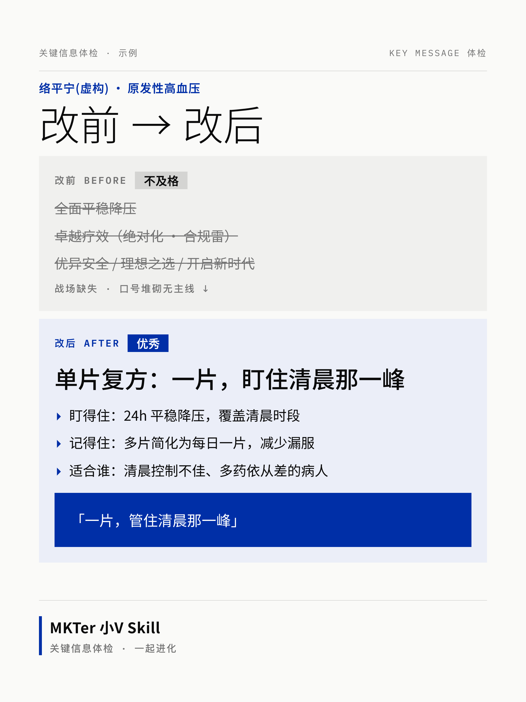

# MKTer 小V · 关键信息体检 Skill

> 医药市场 **关键信息(key message)体检 + 判断校准** 引擎。
> 别人帮你写,它帮你**查**——揪出"换个产品名也成立"的大词虚词,拦住合规雷,把口号改成医生明天能用的一句话。(也能据此顺手写一篇面向医生的产品优势介绍。)
>
> *A pharma-marketing **key-message review & judgment-calibration** engine for AI agents. It doesn't just write — it audits: catches empty buzzwords, blocks compliance red lines, and rewrites slogans into something a doctor can actually use.*

> ⭐ **装上觉得有用?顺手点个 Star** —— 让更多医药市场部同行刷到它,也让我知道这条路走得通。



> 上图为 skill 生成的"改前 vs 改后"对比卡(示例产品**络平宁纯属虚构**)。

---

## 这是什么

一个给 AI(Claude Code / 任意对话式 AI)用的**医药市场内容审视引擎**。喂给它产品的定位、策略、疾病领域、关键信息,它会:

1. **体检评级** —— 给定位 & 关键信息打分:及格 / 良好 / 优秀,一句话总诊断。
2. **逐条挑刺** —— 扫大词虚词、查策略能不能落地、查信息有没有主线、过合规红线。
3. **改写落地版** —— 选战场、定一条主信息 + 支撑(每条要有"具体病人 / 可记住一句话 / 医生的动作")。
4. **撰写成品** —— 据此写一篇面向医生的产品优势介绍(自带合规拦截)。
5. **可选** —— 生成可直接发的"改前 vs 改后"对比卡图片(瑞士国际主义风格)。

## 为什么做它

> 真正的问题不是"帮市场部写文案",是**市场部自己看不出自己在说正确的废话**。

"全面提升 / 卓越疗效 / 创新引领 / 理想之选"——每个竞品都这么写,医生一条都不信,而且常埋着合规雷(绝对化宣称、裸数据、暗示扩适应症)。通用 AI 文案工具不懂治疗领域、更不懂处方药合规,只会把大词换成更花的大词。这个引擎补的就是**判断 + 合规 + 落地改写**这一层。

## 怎么用

**作为 Claude Code skill**:把本仓库放进 `~/.claude/skills/key-message-review/`,然后对 AI 说"用关键信息体检帮我看看这条 message"。

**作为通用提示词**:把 `SKILL.md` 的内容粘进任意对话式 AI(豆包 / ChatGPT / Claude 网页),它会自动降级成"编号提问"模式,照样能跑。
> ⚠️ 注意:粘贴模式跑的是**精简版**——评分卡细则、大词黑名单、合规红线清单这些 `references/` 文件没跟着进去,挑刺细度和红线覆盖会打折。要全套能力,用 Claude Code 装完整仓库。

**三档深度**:速检(只体检挑刺)/ 标准(+ 落地改写)/ 深档(+ 模拟医生 Q&A + 对比卡)。
**🆕 评审团(增强档,点名才启动)**:说"上评审团"——多位评委按透镜盲审 + 反驳者对抗验证 + 主笔合成,适合正式交活的 message/品牌手册;需多智能体环境,单对话自动降级"多轮自审";消耗约标准档 30–50 倍。协议见 `references/评审团协议.md`。

### 生成"改前 vs 改后"对比卡

```bash
# 依赖:Node 18+ 与 playwright(或本机 Google Chrome,脚本会自动回退)
npm i -D playwright && npx playwright install chromium

node scripts/render-card.mjs examples/络平宁-card.json out.png
```

文字类对比卡用 **HTML 渲染**(文字像素级精确),不用文生图。数据 schema 见 `scripts/render-card.mjs` 头注释或 `examples/络平宁-card.json`。

### 自定义你自己的产品

复制 `EXTEND.example.md` 为 `EXTEND.md`,填入你的产品名、受众、可用数据、**禁用词**与术语规范。`EXTEND.md` 已被 `.gitignore` 忽略——你的真实数据只留在本地,不会进仓库。

## 目录

| 文件 | 作用 |
|---|---|
| `SKILL.md` | 入口:4 步工作流 + 三档 + 评级 + references 索引 |
| `references/` | 方法内核:大词虚词黑名单 / 有效信息三要素 / 策略可执行性检验 / 合规红线 / 评分卡 / 视觉信息权重倒挂 |
| `assets/compare-card.html` | 对比卡模板(瑞士风,数据驱动) |
| `scripts/render-card.mjs` | 把对比卡渲染成 PNG |
| `EXTEND.example.md` | 用户偏好/禁用词模板 |
| `examples/` | 全脱敏样张(虚构产品) |
| `能力圈.md` | 做什么 / 不做什么 + 不可协商红线 |

## ⚠️ 免责声明

- 本工具做的是**内容质量审视 + 落地改写 + 常见合规风险初筛**,**不替代**任何公司的医学与法规审核(MA/RA)。
- **不提供医疗或法律建议**;所有疗效/安全数据须以产品说明书为准,工具不会、也不应杜撰数据。
- 仓库内所有示例产品(如"络平宁")**纯属虚构**,仅作演示。
- 使用者对其最终产出的合规性负责。

## License

[MIT](LICENSE) © 2026 MKTer 小V

---

*Made by **MKTer 小V** · 一起进化 —— 一线医药市场人 × AI 的内容工作方式。*
